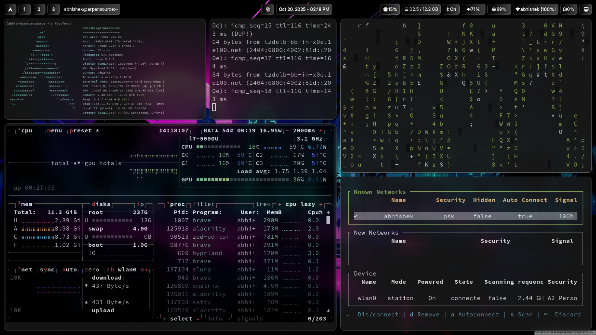

<div align="center">

**ASHAR**

*A beautifully crafted Hyprland desktop environment for Arch Linux*

[](https://archlinux.org/)
[](https://hyprland.org/)
[](LICENSE)

[Features](#-features) • [Screenshots](#-screenshots) • [Installation](#-installation) • [Keybindings](#%EF%B8%8F-keybindings) • [Customization](#-customization)

</div>

---
**ASHAR** - **A**rpan**S**ource's **H**yprland **A**rch **R**ice, is a **performance-focused, terminal-centric** Arch Linux rice built for developers who value speed over bells and whistles. This setup embraces **minimalism as a feature**, not a limitation—every component is chosen for efficiency and performance.


##    Screenshots

<div align="center">


*ASHAR featuring the Deepspace color scheme*

</div>

<details>
<summary>Click to view more screenshots</summary>

<!-- Add more screenshots -->

</details>

### Installation
- Make sure you have curl installed
```bash
sudo pacman -S curl --needed
```
- Run the installer script
```bash
curl -fsSL https://raw.githubusercontent.com/arpansource/ashar/main/ashar.sh | bash
```

### Core Principles

- **🚀 Performance First** - Lightweight, blazing-fast applications that don't waste resources
- **⌨️ Terminal-Centric** - TUI over GUI wherever possible. The terminal is your home
- **🎨 Aesthetic Minimalism** - Beautiful doesn't mean bloated. Clean, focused, distraction-free
- **⚡ Developer-Optimized** - Built by developers, for developers. Fast compile times, instant feedback
- **🔧 Intentional Choices** - Every app serves a purpose. No redundancy, no bloat

## 💡 Why ASHAR?

This isn't your typical eye-candy rice with animations and transparency everywhere. ASHAR is designed for:

- Developers who **live in the terminal**
- Users who prefer **keyboard over mouse**
- Systems where **every millisecond matters**
- Workflows that demand **maximum efficiency**

If you want fancy effects and GPU-intensive animations, look elsewhere. If you want a **snappy, responsive system** that gets out of your way and lets you work, you're in the right place.

## 🎨 Features

- 🖥️ **TUI-First Approach** - Terminal applications are prioritized for speed and efficiency
- ⚡ **Performance Optimized** - Carefully selected lightweight alternatives to bloated software
- 🎯 **Developer Workflow** - Keybindings and tools optimized for coding and productivity
- 🌈 **Minimal Aesthetics** - Clean, focused interface without unnecessary visual clutter
- 🔋 **Resource Efficient** - Perfect for older hardware or extending battery life
- ⌨️ **Keyboard-Driven** - Mouse usage minimized, everything accessible via keybindings

## 🚀 Performance-Focused Application Stack

ASHAR replaces common resource-heavy applications with lightweight, performant alternatives:

| Instead of... | ASHAR uses... | Why? |
|---------------|---------------|------|
| Chrome / Firefox | **Brave** | Privacy-focused, faster, less RAM usage |
| VSCode / Cursor / Windsurf | **Zed** | Native performance, instant startup, minimal memory footprint |
| GNOME Terminal / Konsole | **Alacritty** | GPU-accelerated, fastest terminal emulator available |
| Node.js | **Bun** | 3x faster runtime, drop-in replacement with better performance |
| Electron Apps | **Native Alternatives** | No bloated web wrappers, true native performance |

### TUI Applications (Terminal User Interface)

Where others use GUI apps, ASHAR leverages powerful TUI alternatives:

- **btop** - System monitor (replaces GUI task managers)
- **lazygit** - Git interface (replaces GitKraken, GitHub Desktop)
- **ranger/yazi** - File manager (TUI alternative to GUI file browsers)
- **ncmpcpp** - Music player (lightweight audio control)
- **newsboat** - RSS reader (stays in terminal)

> **Note:** You're free to install heavier alternatives (Chrome, VSCode, etc.) anytime. ASHAR simply provides optimized defaults.

## ⚙️ Who Is This For?

### ✅ Perfect For:
- Backend developers and systems programmers
- DevOps engineers and sysadmins
- Power users who live in the terminal
- Users with older hardware seeking modern performance
- Anyone tired of bloated development environments
- Minimalists who appreciate functional beauty

### ❌ Not For:
- Users who prefer GUI-heavy workflows
- People seeking maximum visual effects and animations
- First-time Linux users (intermediate knowledge recommended)
- Those who need Adobe Creative Suite or Windows-only software


### KNOWN Quirks
- If zed fails starting try running it with --foreground option `zed . --foreground`
- If the logs show -- `Unable to init GPU context: Platform(Init(ERROR_INITIALIZATION_FAILED))` then try installing vulkan drivers for you Graphic. for intel -- `vulkan-intel`
